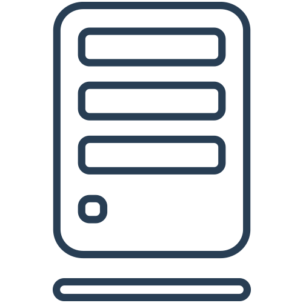
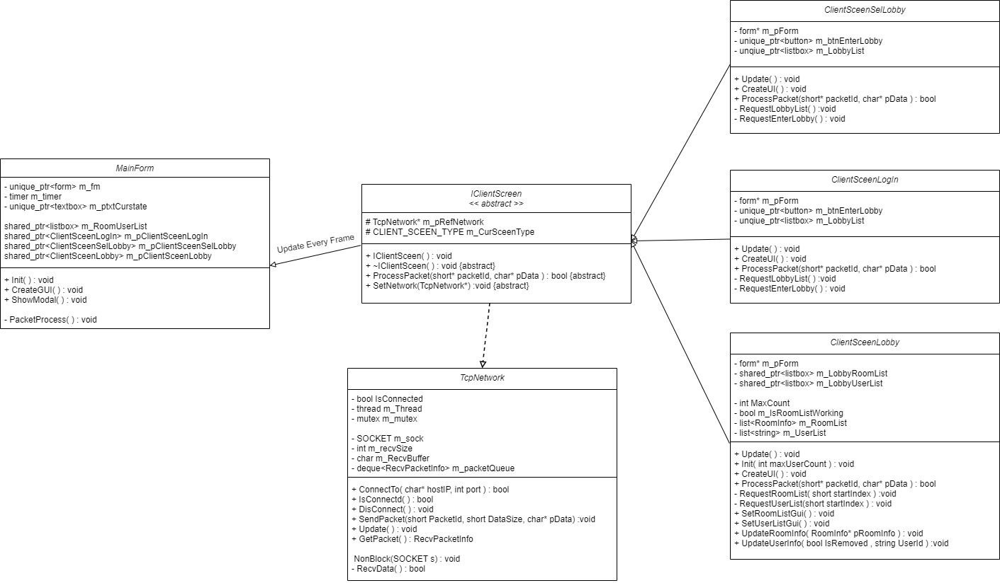
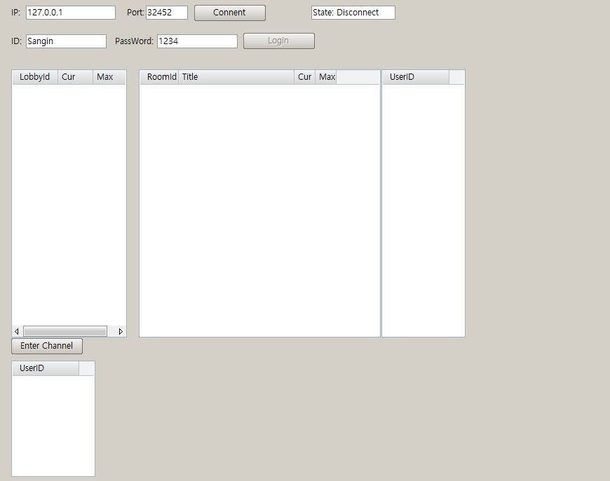

<!-- PROJECT LOGO -->
 

  

  <h3 align="center">SELECT IO CHATTING SERVER</h3>

  

    Server Client Project based on select IO Server 
  

<!-- TABLE OF CONTENTS -->

  
Table of Contents

  <ol>
    <li>
      <a href="#about-the-project">About The Project</a>
      <ul>
        <li><a href="#built-with">Built With</a></li>
      </ul>
    </li>
    <li><a href="#Sample-Demo">SampleDemo</a></li>
    <li><a href="#TODO">TODO</a></li>
    <li><a href="#acknowledgments">Acknowledgments</a></li>
  </ol>

<!-- ABOUT THE PROJECT -->
## About The Project

Using Socket API, build the server and multi  Chat Program. 

(<a href="#top">back to top</a>)

### Built With

* [NaNaGUI](http://nanapro.org/en-us/)
* [C++](https://www.cplusplus.com/)

(<a href="#top">back to top</a>)

<!-- USAGE EXAMPLES -->
## Sample Demo

User Demo for Client and Server 
<pre>
Client <-> SELECT SERVER <-> Client
  |-- Data Packet Send / Recv --|
</pre>

### Client Explanation
1. Client uses Nana GUI to make ...

### Client UML

### Client GUI

(<a href="#top">back to top</a>)

<!-- TODO -->
## TODO

- [x] Nana GUI Client
- [x] Select Server
- [ ] Boost / Iocp
- [ ] Packet Serialization
- [ ] Memory Pool

See the [open issues](https://github.com/github_username/repo_name/issues) for a full list of proposed features (and known issues).

(<a href="#top">back to top</a>)

<!-- ACKNOWLEDGMENTS -->
## Acknowledgments

* 

(<a href="#top">back to top</a>)

